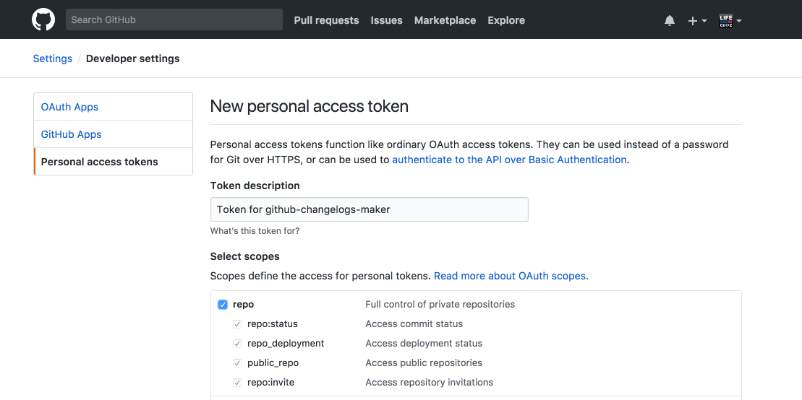

# github-changelogs-maker

## Description

- Generate changelogs between 2 latest releases

## How to install

```js
npm install -g github-changelogs-maker
```

## How to use

### Access token

Firstly, you need a personal access token to access list of repos.

- Go to [Personal access tokens](https://github.com/settings/tokens)
- Choose `Generate new token`
- In `Select scopes`, choose just `repo`
- Run `github-changelogs-maker --token=YOUR_TOKEN` to specify your token. This is needed only when you change your token. It is cached so you don't need to specify it again.



### Generating changelog

**Step 1: Add new release 🚀**

To lists all closed issues and merged pull requests between 2 lastest releases, so you need to create a new release first.

**Step 2: Specify owner and repo 😎**

This is all you need to do

```js
github-changelogs-maker --owner=OWNER --repo=REPO
```

For example, this is how it is done in https://github.com/Alamofire/Alamofire to diff betweens https://github.com/Alamofire/Alamofire/releases/tag/4.5.1 and https://github.com/Alamofire/Alamofire/releases/tag/4.5.0

```js
github-changelogs-maker --owner=Alamofire --repo=Alamofire
```

**Step 3: Copy the changelog 🎸**

The changelog is print to the console, just copy and paste it into your new release description.

Here is how it looks for Alamofire https://github.com/Alamofire/Alamofire/releases/tag/4.5.1

```
Merged pull requests
- Add GitHub templates for issues and PRs. https://github.com/Alamofire/Alamofire/pull/2179, by [jshier](https://github.com/jshier)
- Remove Swift version checking for Xcode 9 beta 3. https://github.com/Alamofire/Alamofire/pull/2198, by [jshier](https://github.com/jshier)
- Add an NSLock for the task delegate’s task. https://github.com/Alamofire/Alamofire/pull/2190, by [jshier](https://github.com/jshier)
- Update README.md https://github.com/Alamofire/Alamofire/pull/2244, by [andyRon](https://github.com/andyRon)
- Add Jazzy Docs https://github.com/Alamofire/Alamofire/pull/2250, by [aamctustwo](https://github.com/aamctustwo)
- Update docs with root_url to properly allow Dash downloads. https://github.com/Alamofire/Alamofire/pull/2255, by [jshier](https://github.com/jshier)
- Fix dash download https://github.com/Alamofire/Alamofire/pull/2258, by [jshier](https://github.com/jshier)
- Added resolved radars section to the README and moved 26761490 into it. https://github.com/Alamofire/Alamofire/pull/2263, by [cnoon](https://github.com/cnoon)
- Update Readme to current version https://github.com/Alamofire/Alamofire/pull/2266, by [kimdv](https://github.com/kimdv)
- Fixed `substring` API warnings for Swift 3.2 and up https://github.com/Alamofire/Alamofire/pull/2240, by [htinlinn](https://github.com/htinlinn)
- Alamofire 4.5.1 Release https://github.com/Alamofire/Alamofire/pull/2267, by [cnoon](https://github.com/cnoon)
- fix updated Requirements https://github.com/Alamofire/Alamofire/pull/2212, by [Coeur](https://github.com/Coeur)

Closed issues
- Send utf-8 parameters https://github.com/Alamofire/Alamofire/issues/2247
- Thread sanitizer issue during retry https://github.com/Alamofire/Alamofire/issues/2189
- Build error with Swift Package Manager https://github.com/Alamofire/Alamofire/issues/1544
- Invalid value around character 0. https://github.com/Alamofire/Alamofire/issues/2256
- Request Hashed Public Key Pinning https://github.com/Alamofire/Alamofire/issues/2248
- How can I send Parameters like:  [[String: Any]] instead [String: Any] ? https://github.com/Alamofire/Alamofire/issues/2257
- Https request using Alamofire with AWS beanstalk, nodejs , and NginX https://github.com/Alamofire/Alamofire/issues/2259
- How do I make NTLM request? https://github.com/Alamofire/Alamofire/issues/367
- 403 error for responseData call if the url has expiry  https://github.com/Alamofire/Alamofire/issues/2262
- Swift 4 Warning: (String slicing subscript instead of substring(with:)) https://github.com/Alamofire/Alamofire/issues/2261
- http://www.asiandate.com/login/mailsystem/inbox/message828231441.html?token=7eb8a82b8f074a490ac819b4bf17c24f https://github.com/Alamofire/Alamofire/issues/2264
- Failed to load Info.plist from bundle https://github.com/Alamofire/Alamofire/issues/1796
- Add Jazzy Docs https://github.com/Alamofire/Alamofire/issues/2224
```


## Author

Khoa Pham, onmyway133@gmail.com

## License

**github-changelogs-maker** is available under the MIT license. See the [LICENSE](https://github.com/onmyway133/github-changelogs-maker/blob/master/LICENSE.md) file for more info.
